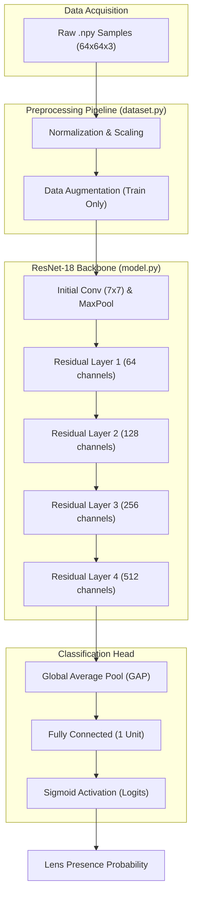
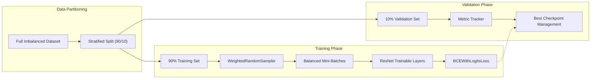

# Gravitational Lens Identification Model

This project implements a deep learning pipeline using **PyTorch** to identify gravitational lenses in astronomical images. It is specifically designed to handle a significant class imbalance between "Lens" and "Non-Lens" images.


## System Architecture (In-Depth)



## Training Workflow (Anti-Imbalance Strategy)



## Technical Implementation Details

### Data Partitioning Strategy
To ensure the model generalizes well across the unbalanced classes:
- **Stratified Splitting**: We use `scikit-learn`'s `train_test_split` with `stratify=targets`. This ensures that the 10% validation set retains the exact same "Lens" vs "Non-Lens" ratio as the original imbalanced data.
- **Dynamic Sampling**: During training, a **WeightedRandomSampler** is used to oversample the minority "Lens" class within each batch, forcing the model to learn the specific features of gravitational lenses rather than converging to a majority-class predictor.

### Achieved Performance Metrics (Test Set)
On a highly imbalanced test set of **19,650 samples** (~100:1 ratio), the model achieved the following performance after threshold optimization:

| Metric | Value |
| :--- | :--- |
| **Accuracy** | 99.22% |
| **Precision (Lens)** | 0.61 |
| **Recall (Lens)** | 0.61 |
| **F1-Score** | 0.61 |
| **ROC-AUC** | **0.9751** |

> [!IMPORTANT]
> **Performance Analysis**: While the F1-score of 0.61 reflects the difficulty of identifying only 195 lenses among 19,455 non-lenses, the **ROC-AUC of 0.975** indicates that the model has excellent discriminative power. The chosen threshold of **0.8728** was found to be the optimal point for balancing discovery rate and false positive mitigation.


> [!TIP]
> **Threshold Optimization**: We do not use the default 0.5 threshold. The evaluation script automatically finds the threshold that maximizes the **F1-Score**, significantly improving detection performance on skewed datasets.


## Model Architecture Details (ResNet-18)
The model uses a standard ResNet-18 backbone. For the **64x64** input size, the spatial progression is as follows:
- **Input**: 64x64x3
- **Initial Conv/Pool**: 16x16
- **Residual Blocks**: Progressively downsamples to 8x8, 4x4, and finally 2x2.
- **Global Average Pool**: 1x1
- **Fully Connected**: Binary output (1 unit)

---

## Project Structure
- `dataset.py`: Custom PyTorch `Dataset` for loading 64x64x3 `.npy` images. Includes basic data augmentation (flips).
- `model.py`: **ResNet-18** architecture modified for binary classification.
- `train.py`: Main training script with specialized sampling and weighted loss logic.
- `evaluate.py`: Post-training evaluation script to calculate F1-score and ROC-AUC.
- `training_log.csv`: Automatically generated during training to track progress.

## Strategy for Class Imbalance
To ensure the model doesn't just predict "Non-Lens" (the majority class), we use:
1.  **WeightedRandomSampler**: Every training batch is forced to have a balanced representation of both classes.
2.  **Weighted BCE Loss**: The loss function (`BCEWithLogitsLoss`) is configured with a `pos_weight` to penalize misclassifications of the minority "Lens" class more heavily.

## Requirements
- Python 3.10+
- PyTorch with CUDA support (Recommended for **RTX 3050**)
- NumPy, scikit-learn, matplotlib, seaborn

## Usage

### 1. Data Preparation
Ensure the following directories are present in the project root:
- `train_lenses/`
- `train_nonlenses/`
- `test_lenses/`
- `test_nonlenses/`

### 2. Training
Run the training script to train the ResNet-18 model:
```bash
python train.py
```
This will log metrics to `training_log.csv` and save model checkpoints periodically.

### 3. Evaluation
After training, evaluate the best model on the test set:
```bash
python evaluate.py
```
This will display the classification report and save a `confusion_matrix.png` to disk.

## Optimization Notes
- **Hardware**: The project is optimized for an **RTX 3050 (4GB)**. 
- **Input Shape**: The model expects `(3, 64, 64)` tensors derived from `.npy` files.
- **Batch Size**: Default is set to **32** for VRAM safety. Modify in `train.py` if needed.
